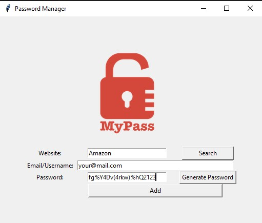

# Password Manager

## Overview
The **Password Manager** is a Python application with a graphical interface that helps you securely generate, store, and retrieve passwords for different websites. This tool is ideal for keeping your online credentials organized and secure.


---

## Features
### 🔒 **Password Generator**
- Generates strong, random passwords containing a mix of letters, numbers, and symbols.
- Automatically copies the generated password to your clipboard for easy use.

### 💾 **Save Passwords**
- Stores website credentials (website, email/username, and password) in a JSON file.
- Automatically checks for empty fields to prevent errors during saving.

### 🔍 **Search Functionality**
- Quickly retrieves stored credentials by searching for the website name.
- Displays the email/username and password for the selected website.
- Informs the user if the website is not found in the saved data.

### 🎨 **User-Friendly Interface**
- Built with `tkinter`, featuring a clean, intuitive layout for seamless user interaction.

---

## How It Works

### 1. Generate Password
- Click the **Generate Password** button to create a strong, random password.
- The password is automatically inserted into the "Password" entry field and copied to the clipboard.

### 2. Save Credentials
- Enter the website name, email/username, and password into the respective fields.
- Click the **Add** button to save the credentials to a JSON file (`data.json`).
  - If the file does not exist, it is created.
  - If the file exists, new data is added without overwriting previous entries.

### 3. Search for Credentials
- Enter a website name in the "Website" field and click the **Search** button.
- If the website is found, the associated email/username and password are displayed in a pop-up window.
- If not found, an error message is shown.

---

## Installation and Setup

### Prerequisites
- **Python 3.8+**
- Required Python libraries:
  - `tkinter` (comes pre-installed with Python)
  - `random` (comes pre-installed with Python)
  - `pyperclip` (install via `pip install pyperclip`)
  - `json` (comes pre-installed with Python)

### Steps to Run
1. Clone or download this repository.
2. Ensure the `logo.png` file is in the correct directory (`./password_manager/`).
3. Install required dependencies:
   ```bash
   pip install pyperclip
