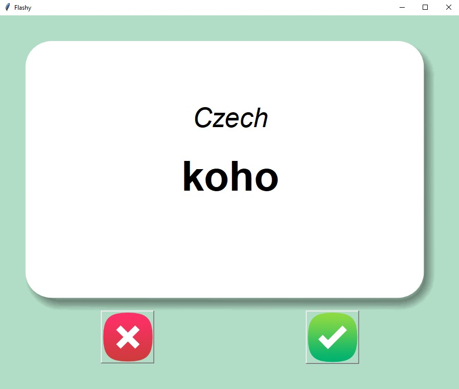

# Flash Card Application

This project is a **Flash Card Application** designed to help users learn new words in Czech using interactive flashcards. The app displays a word on the front of the card and flips to reveal the translation after a set time. Users can mark words as "known" or "unknown" to track their learning progress.

## Preview

<div align="center">
   
</div>

## Features
- Displays words in Czech with a corresponding English translation.
- Cards automatically flip after a timer to reveal the translation.
- Users can mark words as "known" or "unknown" using intuitive buttons.
- Keeps track of words learned and adjusts the study deck dynamically.

---

## Project Structure
1. **Flashcard Images**
   - Contains front and back card images for a visually appealing experience.

2. **Core Functionality**
   - Uses the `Canvas` widget to render flashcards and manage word transitions.
   - Timer-based card flipping implemented with `window.after()`.

3. **Interactive Buttons**
   - `Check` (✓): Marks a word as "known" and moves to the next card.
   - `Cross` (✗): Keeps the word in the study deck and moves to the next card.

---

## How to Use
1. **Run the Application**  
   Execute the Python script to start the application.  
   ```bash
   python flash_card_app.py
