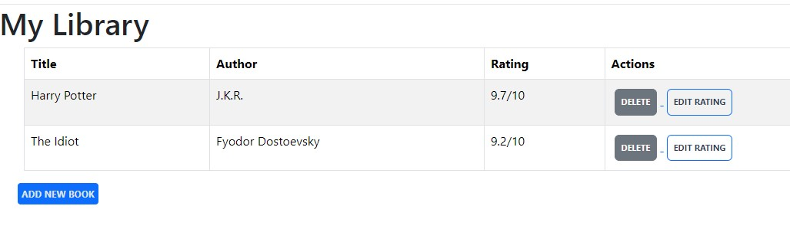

# Library Table

This project is a simple web application to manage a library. It displays books in a table format with options to edit their ratings or delete them.

## Features

- Displays book details (Title, Author, and Rating).
- Includes action buttons for:
  - **Delete**: Removes a book from the library.
  - **Edit Rating**: Updates the book's rating.
- Built with Flask and Bootstrap for styling.

## Preview



## Technologies Used

- **Python**: Backend logic using Flask.
- **Flask-SQLAlchemy**: For managing the database and models.
- **HTML/CSS**: Frontend structure and design.
- **Bootstrap**: To enhance UI/UX with prebuilt styles.

## How to Run

1. Clone the repository:
   ```bash
   git clone https://github.com/your-repo/library-table.git
