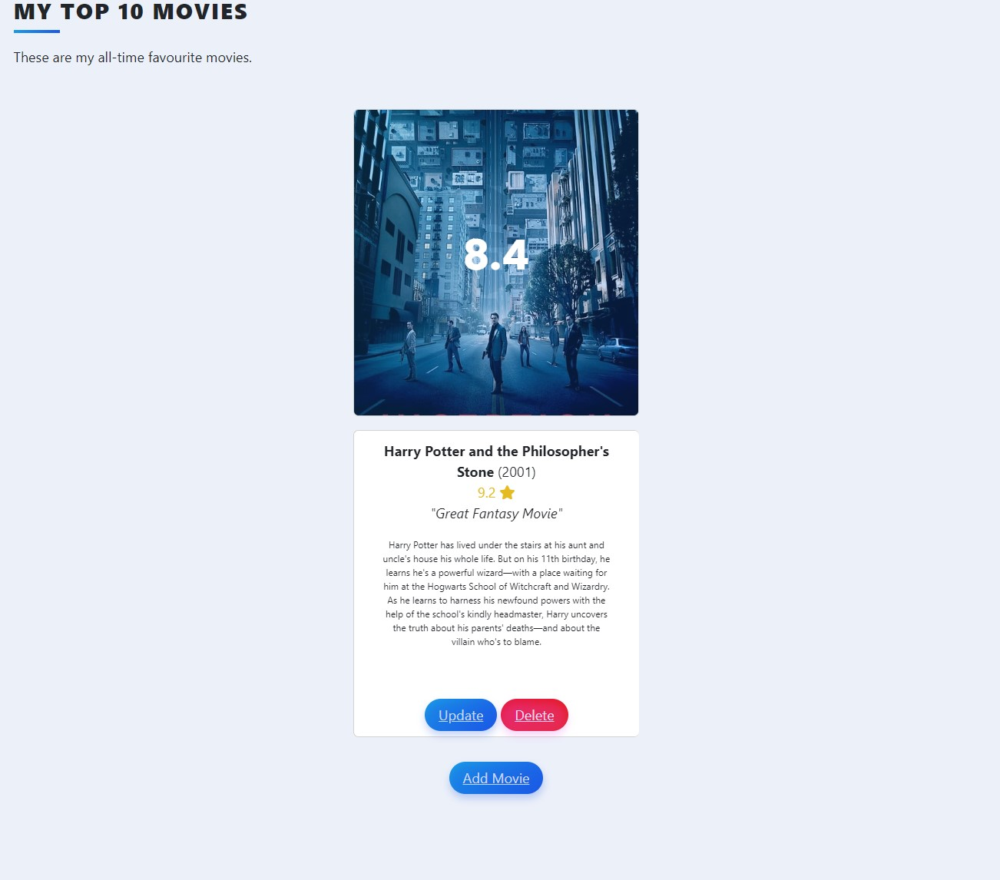

# Movie Collection Web App 🎬

This project is a Flask-based web application for managing a collection of movies. Users can view, add, edit, and delete movies, as well as fetch movie data from The Movie Database (TMDb) API.
## 🍿 Preview

  

## 📽️ Features

- Display a list of movies stored in the database.
- Add movies by searching for their title using TMDb API.
- Edit movie ratings and reviews.
- Delete movies from the database.
- Prefill the rating and review fields when editing existing movies.

## Prerequisites

- Python 3.x
- Flask and related libraries
- SQLite (bundled with Python)
