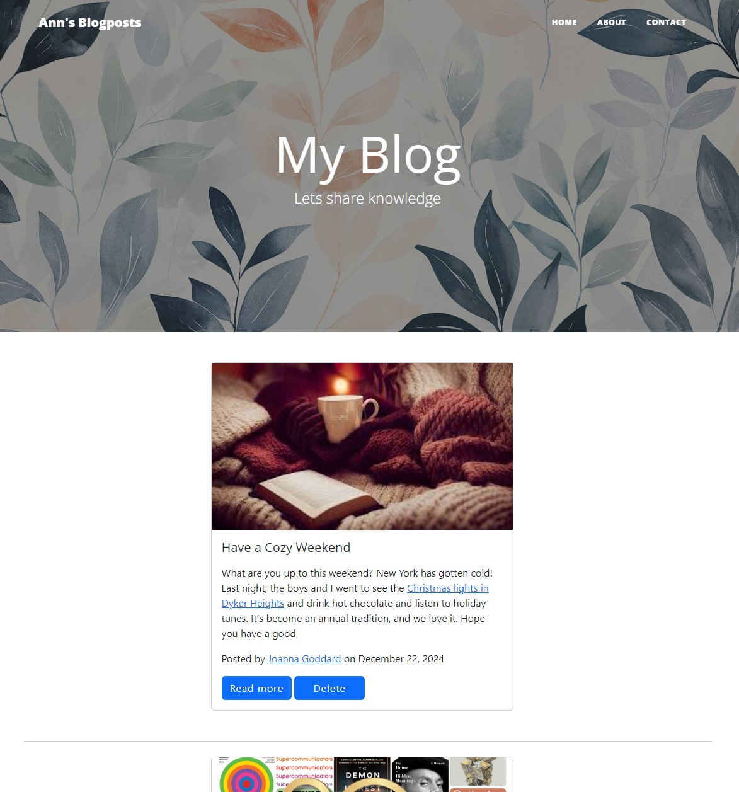

# Flask Blog Application

  

This project is a simple blog application built with Flask. It allows users to create, edit, view, and delete blog posts. The project includes features like a WYSIWYG editor (CKEditor), Bootstrap for responsive design, and SQLAlchemy for database management.

---

## Features

- Create, edit, and delete blog posts.
- Use CKEditor for rich text formatting.
- Display all posts on the homepage.
- View individual blog posts with unique URLs.
- Responsive design with Bootstrap.
- SQLite database integration with SQLAlchemy ORM.

---

## Prerequisites

Before running the application, ensure you have the following installed:

- Python 3.7 or higher
- Virtual environment (optional but recommended)
- Required Python packages (specified in `requirements.txt`)

---

## Technologies Used

Flask: Web framework  
Flask-WTF: Form handling  
Flask-CKEditor: Rich text editor  
SQLAlchemy: ORM for database management  
Bootstrap: Frontend styling  
SQLite: Lightweight database  
