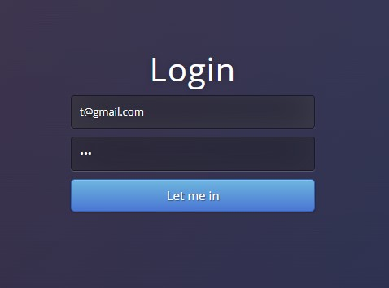

# Flask Authentication Application

This is a simple authentication application built with Flask that provides the following features:

  

- **User Registration**: Allows users to create an account with a secure password.
- **Login/Logout Functionality**: Users can log in to access restricted routes and log out to end their session.
- **Protected Routes**: Routes that are accessible only to authenticated users.
- **Password Hashing**: Uses `werkzeug.security` for secure password storage.
- **Session Management**: Manages user sessions to ensure seamless authentication.

## Technologies Used

- **Flask**: Micro web framework for Python.
- **Flask-SQLAlchemy**: ORM for database interactions.
- **Flask-WTF**: Simplifies form handling.
- **Flask-Login**: Manages user session states.
- **Werkzeug Security**: Provides secure password hashing and verification.
- **WTForms**: Handles form validation.

## Features

1. **User Registration**  
   Users can sign up by providing their email, a secure password, and additional information as needed.

2. **Login and Logout**  
   - Login: Validates credentials and starts a session.
   - Logout: Ends the user session securely.

3. **Protected Routes**  
   Restricted content is available only to authenticated users. Unauthorized users are redirected to the login page.

4. **Secure Password Handling**  
   - Passwords are hashed using `generate_password_hash` from Werkzeug.
   - Login verifies passwords with `check_password_hash`.

5. **Session Management**  
   Flask-Login ensures authenticated users stay logged in across sessions.
