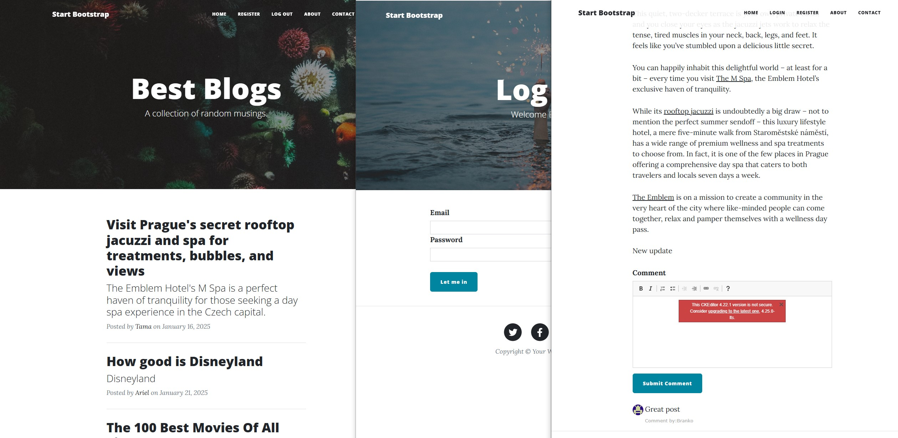

# Flask Blog Application

This is a Flask-based blogging platform that allows users to register, log in, create, view, comment on, and manage blog posts. The application incorporates user authentication, an admin-only mode for sensitive operations, and relationships between blog posts, users, and comments.

<p style="text-align: center;">
  
</p>

## Features

### User Authentication
- Register and log in using secure password hashing with `werkzeug.security`.
- Admin-only functionality protected by a custom decorator.

### Blog Posts
- Create, read, and delete blog posts.
- Each blog post is associated with an author.

### Comments
- Commenting system linked to blog posts and users.
- Relationship between comments, blog posts, and users is maintained using SQLAlchemy.

### Admin-Only Access
- Certain actions (e.g., deleting sensitive data) are restricted to the admin user (User ID: 1).

### HTML Forms
- Includes Flask-WTF forms for login, registration, and comment submission.

### Database Relationships
- Blog posts are linked to authors (users) via foreign keys.
- Comments are linked to blog posts and the users who wrote them.

## Technologies Used

- **Backend**: Flask, Flask-SQLAlchemy, Flask-Login, Flask-WTF
- **Database**: SQLite
- **Frontend**: HTML5, CSS3, Bootstrap
- **Authentication**: Password hashing with `werkzeug.security`
- **Version Control**: Git and GitHub

## Installation

1. Clone the repository:
   ```bash
   git clone <repository_url>
   cd <repository_directory>
