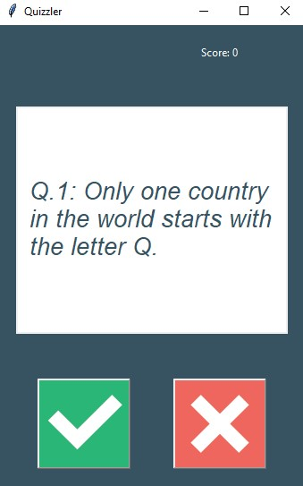

# Quiz Application

This project is a simple **Quiz Application** built in Python. The application uses Object-Oriented Programming (OOP) principles to manage the questions and quiz logic. A graphical user interface (GUI) is implemented for an interactive user experience.

---


## Features
- Loads questions and answers from a data file.
- Displays questions through an intuitive graphical interface.
- Tracks and displays the user's progress and score.
- Provides instant feedback on the correctness of each answer.

---

## Project Structure
The project consists of the following main modules:
1. **`question_model.py`**
   - Defines the `Question` class.
   - Represents a question with its text and correct answer.

2. **`data.py`**
   - Contains a list of dictionaries representing quiz questions and answers.

3. **`quiz_brain.py`**
   - Defines the `QuizBrain` class.
   - Handles the quiz logic, such as checking answers, tracking progress, and fetching the next question.

4. **`ui.py`**
   - Implements the `QuizInterface` class.
   - Manages the graphical user interface for the quiz.

5. **Main Script**
   - Loads the data from `data.py`.
   - Creates instances of the `Question` class and populates the question bank.
   - Initializes the `QuizBrain` and `QuizInterface` to run the quiz.

---

## How to Run
1. Clone or download this repository.
2. Install the required dependencies (if any).
   ```bash
   pip install tkinter
